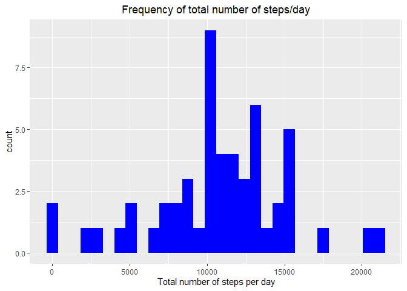
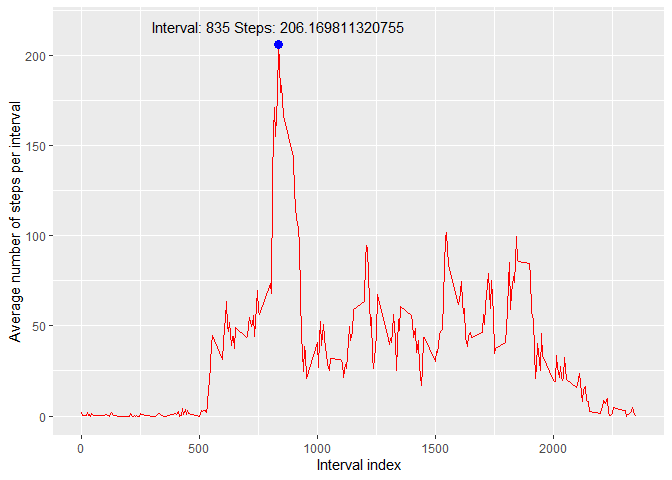
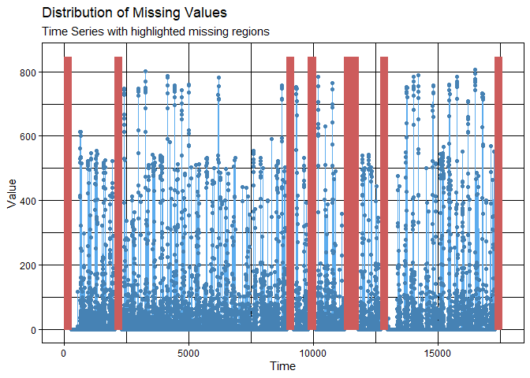
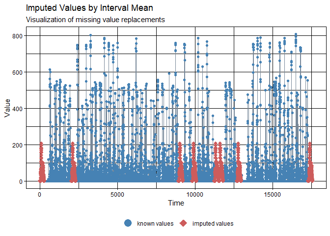
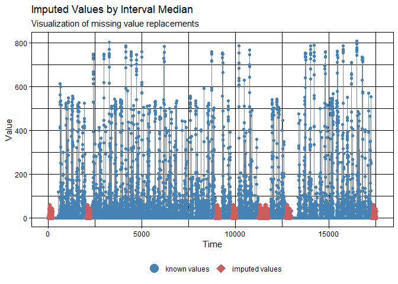
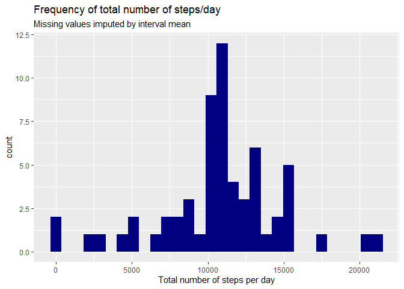
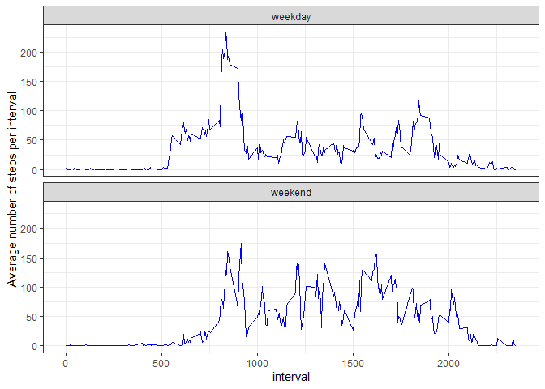

Setting global options: Show the code chunks, suppress any messages and warnings, center figures.

```r
knitr::opts_chunk$set(echo = T, message = F, warning = F, fig.align = "center")
```
## Loading and preprocessing the data

```r
library(tidyverse)
unzip("activity.zip")
data <- read.csv("activity.csv")
```

## What is mean total number of steps taken per day?
Let's group the data by day and then calculate total for each day group.  

```r
day_totals <- group_by(data, date) %>% summarize(total = sum(steps))
ggplot(data=day_totals, aes(total)) +
        geom_histogram(fill = "blue") +
        labs(x = "Total number of steps per day", title = "Frequency of total number of steps/day") +
        theme(plot.title = element_text(hjust = 0.5))
```


  
Mean of total number of steps taken per day:  

```r
mean(day_totals$total, na.rm = T)
```

```
## [1] 10766.19
```
  
Median of total number of steps taken per day:  

```r
median(day_totals$total, na.rm = T)
```

```
## [1] 10765
```

## What is the average daily activity pattern?
Let's group the data by interval index and then calculate average of each interval group. Also, create a label column that will be used to label the maximum point on the graph.   
The interval index with maximum number of steps on average across all days is labeled on the graph. 

```r
int_avg <- group_by(data, interval) %>% summarize(avg = mean(steps, na.rm = T)) %>% mutate(lab = paste("Interval:",interval, "Steps:", avg))
ggplot(int_avg, aes(interval, avg)) + 
        geom_line(col = "red") +
        geom_point(data = int_avg[which.max(int_avg$avg), ], color = "blue", size = 3) + 
        geom_text(data = int_avg[which.max(int_avg$avg), ], aes(interval, avg+10, label = lab)) + 
        labs(x = "Interval index", y = "Average number of steps per interval")
```




## Imputing missing values

The data in this assignment is a *time series* data. As such, any imputation method needs to consider fit to the pattern of the time continuum of the data. I will use `imputeTS` package for imputing and exploring missig values, which is specifically designed for time series data.
First, let's see the summary of data to see which variables have missing data and how many.


```r
summary(data)
```

```
##      steps            date              interval     
##  Min.   :  0.00   Length:17568       Min.   :   0.0  
##  1st Qu.:  0.00   Class :character   1st Qu.: 588.8  
##  Median :  0.00   Mode  :character   Median :1177.5  
##  Mean   : 37.38                      Mean   :1177.5  
##  3rd Qu.: 12.00                      3rd Qu.:1766.2  
##  Max.   :806.00                      Max.   :2355.0  
##  NA's   :2304
```

Only *steps* variable has missing data with the number of NA's 2304.  

Let's do some exploratory data analysis on NAs to understand how they are distributed to allow us to devise a good imputation strategy.


```r
library(imputeTS)
statsNA(data$steps)
```

```
## [1] "Length of time series:"
## [1] 17568
## [1] "-------------------------"
## [1] "Number of Missing Values:"
## [1] 2304
## [1] "-------------------------"
## [1] "Percentage of Missing Values:"
## [1] "13.1%"
## [1] "-------------------------"
## [1] "Number of Gaps:"
## [1] 7
## [1] "-------------------------"
## [1] "Average Gap Size:"
## [1] 329.1429
## [1] "-------------------------"
## [1] "Stats for Bins"
## [1] "  Bin 1 (4392 values from 1 to 4392) :      576 NAs (13.1%)"
## [1] "  Bin 2 (4392 values from 4393 to 8784) :      0 NAs (0%)"
## [1] "  Bin 3 (4392 values from 8785 to 13176) :      1440 NAs (32.8%)"
## [1] "  Bin 4 (4392 values from 13177 to 17568) :      288 NAs (6.56%)"
## [1] "-------------------------"
## [1] "Longest NA gap (series of consecutive NAs)"
## [1] "576 in a row"
## [1] "-------------------------"
## [1] "Most frequent gap size (series of consecutive NA series)"
## [1] "288 NA in a row (occurring 6 times)"
## [1] "-------------------------"
## [1] "Gap size accounting for most NAs"
## [1] "288 NA in a row (occurring 6 times, making up for overall 1728 NAs)"
## [1] "-------------------------"
## [1] "Overview NA series"
## [1] "  288 NA in a row: 6 times"
## [1] "  576 NA in a row: 1 times"
```

```r
ggplot_na_distribution(data$steps)
```



The summary indicates that there are seven chunks of missing data with consecutive NA values. Six of these chunks have the same length of 288 consecutive NAs, and one has 576 NAs (which appears to be two 288-NA chunks next to each other). The data set starts and ends with a 288-NA chunk. Graphical representation of this scenario is shown.  
Because of large consecutive NA values scenario, it will be difficult to interpolate missing data.  

### Imputing values strategy

I will take the mean and median of each interval ID for each day and substitute the NA values for mean and median of that interval for all days. I will create one column for mean and one for median and create columns where NAs are substituted by mean and median.  
Then compare fit of imputed values to the data and decide if mean or median is the better method.  


```r
int.stats <- group_by(data, interval) %>% summarize(avg = mean(steps, na.rm = T), med = median(steps, na.rm = T))
data.complete <- left_join(data, int.stats, by = "interval") %>% 
  mutate(steps.complete.avg = ifelse(is.na(steps), avg, steps), steps.complete.med = ifelse(is.na(steps), med, steps))

ggplot_na_imputations(data$steps, data.complete$steps.complete.avg, title = "Imputed Values by Interval Mean")
```



```r
ggplot_na_imputations(data$steps, data.complete$steps.complete.med, title = "Imputed Values by Interval Median")
```



It appears that imputation by *mean* fits better to the data so this will be the column from the data set that will be used for the histogram per assignment. 

Creating data set that is identical to the original data set but with missing values filled in, then creating histogram, calculating mean and median:

```r
data.final <- select(data.complete, date, interval, steps.complete.avg)
day_totals.imp <- group_by(data.final, date) %>% summarize(total = sum(steps.complete.avg))
ggplot(data=day_totals.imp, aes(total)) +
        geom_histogram(fill = "navyblue") +
        labs(x = "Total number of steps per day", title = "Frequency of total number of steps/day", subtitle = "Missing values imputed by interval mean")
```


 
Mean of total number of steps taken per day (NAs imputed):  

```r
mean(day_totals.imp$total)
```

```
## [1] 10766.19
```
  
Median of total number of steps taken per day (NAs imputed):  

```r
median(day_totals.imp$total)
```

```
## [1] 10766.19
```

### Summary

As expected, the histogram distribution shape did not change. The frequency changed for some intervals since NAs were replaced.  
Because of the imputation method used, the mean did not change with imputing the NA values by interval means.  
Previously, median was pretty close to the mean but after imputation, they became the same.  

## Are there differences in activity patterns between weekdays and weekends?

First, let's make the date column a Date class, and then create a factor with weekdays. Then reasign the factor values to only two levels.  
Group the data by interval and the day factor, calculate averages and plot the data.


```r
data$date <- as.Date(data$date)
data <- mutate(data, day = factor(weekdays(date)))
levels(data$day) <- list("weekday" = c("Monday", "Tuesday", "Wednesday", "Thursday", "Friday"), "weekend" = c("Saturday", "Sunday"))
int.avg.wkd <- group_by(data, interval, day) %>% summarize(avg = mean(steps, na.rm = T))

ggplot(data = int.avg.wkd, aes(interval, avg)) +
  geom_line(col = "blue") +
  facet_wrap(day~., ncol = 1, nrow =2) + 
  theme_bw() +
  labs(y="Average number of steps per interval")
```



